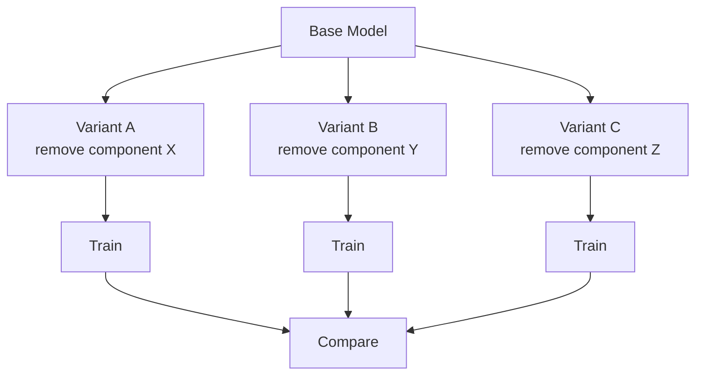

# Ablation Study

Analyze model component contributions through systematic ablation.

## Overview



## Quick Start

```bash
# Run ablation study
python ablation_study.py \
    --config configs/ablation/hgikt_study.json \
    -d assistments09 \
    --fold 0
```

## Parameters

| Parameter | Default | Description |
|-----------|---------|-------------|
| `--config` | Required | Path to ablation config JSON |
| `-d, --dataset` | Required | Dataset name |
| `-f, --fold` | 0 | K-fold index |

## Configuration

Define ablation variants in JSON:

```json
{
  "study_name": "hgikt_ablation_study",
  "base_model": "HGIKT",
  "shared_params": {
    "epochs": 120,
    "learning_rate": 0.0003,
    "batch_size": 64,
    "hidden_dim": 250,
    "dropout": 0.25,
    "weight_decay": 0.00001,
    "es_patience": 10
  },
  "ablations": [
    {
      "name": "baseline",
      "variant": "HGIKT",
      "description": "完整模型（无消融）"
    },
    {
      "name": "hetero_only",
      "variant": "HGIKT_HeteroOnly",
      "description": "只保留完整的异质图分支"
    },
    {
      "name": "hyper_only",
      "variant": "HGIKT_HyperOnly",
      "description": "只保留完整的超图分支（难度加权）"
    }
  ]
}
```

**Configuration Fields:**

| Field | Description |
|-------|-------------|
| `study_name` | Name of the ablation study |
| `base_model` | Base model to compare against |
| `shared_params` | Common training parameters for all variants |
| `ablations` | List of ablation variants |
| `ablations[].name` | Short name for the variant |
| `ablations[].variant` | Registered model variant name |
| `ablations[].description` | Description of what is changed |

## Output

Results saved to `runs/ablation/<study_name>_<timestamp>/`:

```
runs/ablation/hgikt_ablation_study_20240403-120000/
├── results.csv           # All variant results in CSV
└── <variant_name>/       # Individual variant runs
    ├── best_model.pth
    └── hyperparameters.json
```

**Example Comparison:**

| Model | AUC | ACC | Δ AUC |
|-------|-----|-----|-------|
| HGIKT (Full) | 0.785 | 0.742 | - |
| HeteroOnly | 0.762 | 0.721 | -2.9% |
| HyperOnly | 0.751 | 0.710 | -4.3% |
| SimpleFusion | 0.768 | 0.725 | -2.2% |

## Creating Ablation Variants

### Step 1: Create Variant Model

```python
# model/HGIKT/variants/hgikt_hetero_only.py
from model.HGIKT.hgikt_model import HGIKT

class HGIKT_HeteroOnly(HGIKT):
    """Ablation: Only keep heterogeneous graph branch"""

    def __init__(self, **kwargs):
        super().__init__(**kwargs)
        # Remove hypergraph components
        self.hypergraph_conv = None
```

### Step 2: Register Variant

```python
# model/__init__.py
TRAINERS.register_lazy(
    "HGIKT_HeteroOnly",
    "model.HGIKT.variants.hgikt_hetero_only",
    "HGIKT_HeteroOnlyTrainer"
)
```

### Step 3: Add to Config

```json
{
  "ablations": [
    {"name": "hetero_only", "variant": "HGIKT_HeteroOnly", "description": "..."}
  ]
}
```

## Multi-Dataset Ablation

```bash
for dataset in assistments09 assistments12 assistments17; do
    python ablation_study.py \
        --config configs/ablation/hgikt_study.json \
        -d $dataset \
        --fold 0
done
```

## Best Practices

1. **Single Variable**: Change only one component per variant
2. **Same Hyperparams**: Use identical settings for fair comparison
3. **Multiple Runs**: Run 3-5 times with different folds, report mean ± std
4. **Statistical Test**: Use t-test for significance
5. **Document**: Clearly describe what each variant removes/modifies

## Related Docs

- [Training](training.md) - Train individual models
- [Architecture](architecture.md) - Model registration