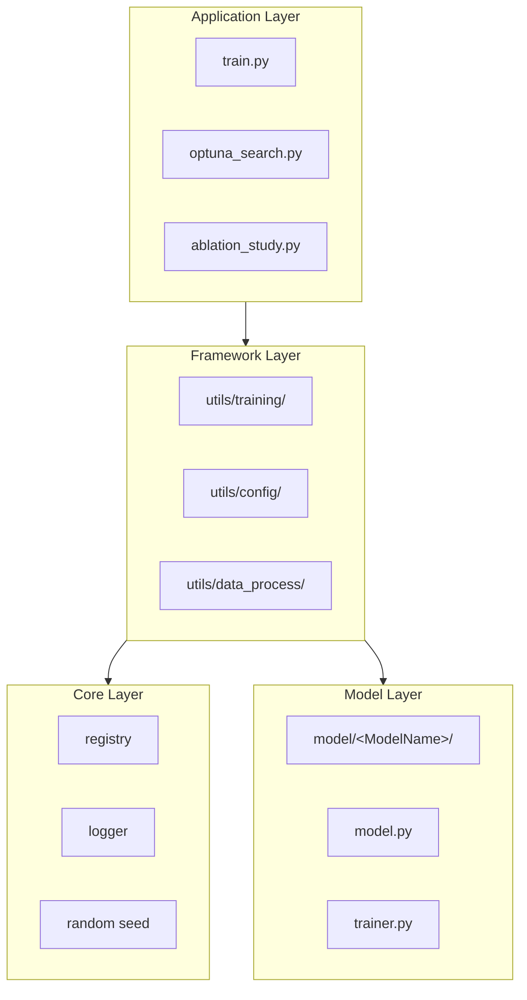

# Architecture

This document describes the framework architecture and how to add custom models.

## Overview



## Registry System

All components are managed through `UniversalRegistry` with lazy loading:

```python
from utils.core import TRAINERS, MODELS, PARAM_CONFIGS

# Register (no import happens)
TRAINERS.register_lazy("HGIKT", "model.HGIKT.HGIKT_trainer", "HGIKTTrainer")

# Access (auto-import on first use)
trainer_cls = TRAINERS.get("HGIKT")
```

**Available Registries:**

| Registry | Purpose |
|----------|---------|
| `TRAINERS` | Model trainers |
| `MODELS` | PyTorch model classes |
| `DATA_SOURCES` | Data source processors |
| `PARAM_CONFIGS` | Parameter configurations |
| `ANALYZERS` | Case analysis components |
| `COMPONENTS` | General-purpose shared components |

## Trainer Pattern

All trainers inherit from `BaseTrainer` with a fluent API:

```python
trainer = MyTrainer(model) \
    .with_training(epochs=150, seed=42) \
    .with_data(train_ds, val_ds, batch_size=128) \
    .with_optimization(optimizer, loss_fn, scheduler) \
    .with_experiment(exp_manager, hyperparams=args) \
    .build()

trainer.run()
```

**Required Implementation:**

```python
class MyTrainer(BaseTrainer):
    def forward_pass(self, batch) -> dict:
        """Return dict with keys: y_hat, y_label, y_predict, y_score, y_prob."""
        logits = self.model(batch)
        y_hat = logits.squeeze(-1)
        y_label = batch["label"].float()
        return {
            "y_hat": y_hat,
            "y_label": y_label,
            "y_predict": (y_hat >= 0.0).float(),
            "y_score": y_hat,
            "y_prob": torch.sigmoid(y_hat),
        }
```

## Adding a New Model

### Step 1: Create Model Directory

```bash
mkdir -p model/MyModel
```

```
model/MyModel/
├── __init__.py
├── MyModel_model.py    # PyTorch model
├── MyModel_trainer.py  # Trainer class
└── MyModel_data.py     # Data processing (optional)
```

### Step 2: Implement Model

```python
# model/MyModel/MyModel_model.py
import torch.nn as nn

class MyModel(nn.Module):
    def __init__(self, n_questions, hidden_dim):
        super().__init__()
        self.embed = nn.Embedding(n_questions, hidden_dim)
        self.rnn = nn.GRU(hidden_dim, hidden_dim, batch_first=True)
        self.head = nn.Linear(hidden_dim, 1)

    def forward(self, batch):
        x = self.embed(batch['question'])
        out, _ = self.rnn(x)
        return self.head(out).squeeze(-1)
```

### Step 3: Implement Trainer

```python
# model/MyModel/MyModel_trainer.py
from utils.training import BaseTrainer

class MyModelTrainer(BaseTrainer):
    def __init__(self, config, **kwargs):
        super().__init__(**kwargs)
        self.model = MyModel(config.n_questions, config.hidden_dim)

    def forward_pass(self, batch):
        logits = self.model(batch)
        loss = self.loss_fn(logits, batch['response'].float())
        return loss, logits
```

### Step 4: Register

```python
# model/__init__.py
TRAINERS.register_lazy("MyModel", "model.MyModel.MyModel_trainer", "MyModelTrainer")
PARAM_CONFIGS.register_lazy("MyModel", "model.MyModel.MyModel_trainer", "MyModelParams")
```

### Step 5: Train

```bash
python train.py -m MyModel -d assistments09
```

## Callback System

The framework provides a callback system for custom behavior during training:

**Available Callbacks:**

| Callback | Purpose |
|----------|---------|
| `EarlyStoppingCallback` | Stop training when metric stops improving |
| `CheckpointCallback` | Save model checkpoints |
| `MemoryCleanupCallback` | Clean up GPU memory |
| `TestEvaluationCallback` | Evaluate on test set after training |

## Data Leakage Prevention

Knowledge tracing requires strict temporal ordering:

- `logits[t]` must only depend on `q[0:t+1]` and `r[0:t]`
- Use `skip_first=True` in `_extract_valid_predictions()`

```python
# In forward_pass
y_hat, y_label, mask = self._extract_valid_predictions(
    logits, batch['response'], batch['mask'], skip_first=True
)
# y_hat[t] predicts y_label[t] = response[t+1]
```

## Project Structure

```
kt-exp-graph/
├── configs/           # Configuration files
│   ├── ablation/      # Ablation study configs
│   └── optuna/        # Optuna search spaces
├── data/              # Processed datasets
├── docs/              # Documentation
├── model/             # Model implementations
│   ├── ABKT/
│   ├── AKT/
│   ├── DKT/
│   ├── DyGKT/
│   ├── GKT/
│   ├── GKT/
│   ├── HGIKT/
│   │   └── variants/  # HGIKT ablation variants
│   ├── SGKT/
│   ├── SimpleKT/
│   ├── SQGKT/
│   └── layers/        # Shared components
├── runs/              # Experiment outputs
├── utils/             # Framework utilities
│   ├── training/      # Training infrastructure
│   │   ├── base_trainer.py
│   │   ├── callbacks.py
│   │   ├── checkpoint.py
│   │   ├── metrics.py
│   │   └── multi_trainer.py
│   ├── config/        # Configuration management
│   ├── core/          # Core (registry, logger)
│   ├── data_process/  # Data processing
│   ├── ablation/      # Ablation framework
│   ├── optuna_utils/  # Optuna tools
│   └── case_analysis/ # Case analysis
├── train.py
├── data_process.py
├── optuna_search.py
├── ablation_study.py
└── case_analysis.py
```

## Related Docs

- [Quick Start](quick_start.md) - Get started quickly
- [Training](training.md) - Training details
- [Data Processing](data_processing.md) - Data pipeline