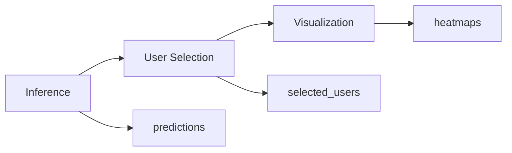

# Case Analysis

Inference, user selection, and visualization for trained models.

## Overview



## Quick Start

### Step 1: Run Inference

```bash
python case_analysis.py inference \
    --run_dir runs/normal/SGKT_assistments09_20240403-120000_fold0_bs128
```

Output: `<run_dir>/case_analysis/predictions.parquet`

### Step 2: Select Users

```bash
python case_analysis.py select \
    --run_dir runs/normal/SGKT_assistments09_20240403-120000_fold0_bs128 \
    --strategy diverse \
    --num_users 10
```

Output: `<run_dir>/case_analysis/diverse/selected_users.json`

### Step 3: Generate Visualizations

```bash
python case_analysis.py plot \
    --run_dir runs/normal/SGKT_assistments09_20240403-120000_fold0_bs128 \
    --selected_users diverse
```

Output: `<run_dir>/case_analysis/diverse/figures/user_*_heatmap.png`

## Commands

### inference

Run model inference and save predictions.

| Parameter | Default | Description |
|-----------|---------|-------------|
| `--run_dir` | Required | Path to run directory containing `best_model.pth` |
| `--hyperparams` | auto | Path to hyperparameters JSON (auto-detect from run_dir) |
| `--data_base_path` | `./data` | Data base path |

### select

Select users from predictions based on filtering criteria.

| Parameter | Default | Description |
|-----------|---------|-------------|
| `--run_dir` | Required | Path to run directory |
| `--strategy` | diverse | Selection strategy (diverse/extreme/random) |
| `--num_users` | 10 | Maximum users to select |
| `--min_seq_len` | 20 | Minimum sequence length |
| `--min_error` | 0.1 | Minimum error rate |
| `--max_error` | 0.9 | Maximum error rate |

### plot

Generate heatmap visualizations for selected users.

| Parameter | Default | Description |
|-----------|---------|-------------|
| `--run_dir` | Required | Path to run directory |
| `--selected_users` | Required | Strategy name or path to `selected_users.json` |
| `--max_seq_len` | None | Maximum sequence length for plotting |

## Selection Strategies

| Strategy | Description | Use Case |
|----------|-------------|----------|
| `diverse` | Sample users from different error rate bins | General analysis |
| `extreme` | Select users with highest/lowest accuracy | Error analysis |
| `random` | Random sampling | Quick inspection |

## Output Structure

```
<run_dir>/case_analysis/
├── predictions.parquet        # All predictions
├── user_summaries.parquet     # User statistics
├── diverse/
│   ├── selected_users.json
│   └── figures/
│       ├── user_123_heatmap.png
│       └── user_456_heatmap.png
├── extreme/
│   └── ...
└── random/
    └── ...
```

## Notes

- Run `inference` before `select` and `plot`
- The `--selected_users` argument accepts:
  - Strategy name: `diverse`, `extreme`, `random`
  - File path: `/path/to/selected_users.json`
- Use `--max_seq_len` in plot to limit heatmap width for long sequences
- If you retrain the model, you need to re-run inference

## Related Docs

- [Training](training.md) - Train models first
- [Architecture](architecture.md) - Framework overview