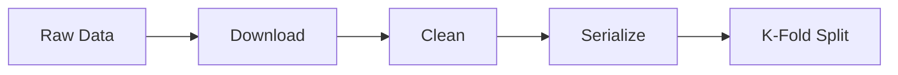

# Data Processing

Download, preprocess, and split datasets for knowledge tracing experiments.

## Pipeline Overview



## Supported Datasets

| Dataset | Source |
|---------|--------|
| `assistments09` | [ASSISTmentsData](https://www.etrialstestbed.org/data-sets) |
| `assistments12` | [ASSISTmentsData](https://www.etrialstestbed.org/data-sets) |
| `assistments15` | [ASSISTmentsData](https://www.etrialstestbed.org/data-sets) |
| `assistments17` | [ASSISTmentsData](https://www.etrialstestbed.org/data-sets) |
| `ednet_kt1` | [GitHub](https://github.com/riiid/ednet) |
| `junyi2015` | [Junyi Academy](https://www.kaggle.com/datasets/junyiacademy/learning-activity-public-dataset) |
| `slepemapy` | [SLEP](https://www.fi.muni.cz/adaptivelearning/) |

## Quick Start

### Download Data

```bash
# Download from source
python data_process.py download -d assistments09

# Force re-download
python data_process.py download -d assistments09 --force

# Custom download URL
python data_process.py download -d assistments09 --data_url https://example.com/data.zip
```

**Download Parameters:**

| Parameter | Default | Description |
|-----------|---------|-------------|
| `--force` | False | Force re-download even if file exists |
| `--max_retries` | 3 | Maximum number of download retries |
| `--num_threads` | 4 | Number of threads for parallel download |
| `--data_url` | None | Override data URL for downloading |

### Process Data

```bash
# Process with default settings
python data_process.py process -d assistments09

# Custom parameters
python data_process.py process \
    -d assistments09 \
    --min_seq_len 3 \
    --max_seq_len 200 \
    --kfold 5 \
    --test_ratio 0.2 \
    --seed 42
```

**Processing Parameters:**

| Parameter | Default | Description |
|-----------|---------|-------------|
| `--min_seq_len` | 3 | Minimum sequence length |
| `--max_seq_len` | 200 | Maximum sequence length |
| `--kfold` | 5 | Number of folds for K-Fold cross-validation |
| `--test_ratio` | 0.2 | Ratio for test set |
| `--seed` | 42 | Random seed for reproducibility |

**Sampling Parameters:**

| Parameter | Default | Description |
|-----------|---------|-------------|
| `--sample_size` | None | Absolute sample count. For random/stratified: number of users. For time: number of interactions (None to disable) |
| `--sample_ratio` | None | Sample ratio (0.0-1.0). Overrides `sample_size` if set. For random/stratified: ratio of users. For time: ratio of interactions |
| `--sample_strategy` | random | Sampling strategy (random, stratified, time) |
| `--sample_attempts_bins` | 20 100 | Attempt count bin edges for stratified sampling |
| `--sample_correct_bins` | 0.4 0.8 | Correct rate bin edges for stratified sampling |

> [!NOTE]
> `--sample_size` and `--sample_ratio` are mutually exclusive. Use one only.
>
> **Sampling strategies:**
> - `random`: Randomly sample N users
> - `stratified`: Stratified sampling based on user attempts and correct rate
> - `time`: Sort interactions by timestamp and take the earliest N records

```bash
# Sample 1000 users randomly
python data_process.py process -d assistments09 --sample_size 1000

# Sample 10% of interactions by time (earliest first)
python data_process.py process -d assistments09 --sample_ratio 0.1 --sample_strategy time

# Stratified sampling with custom bins
python data_process.py process -d assistments09 --sample_size 500 --sample_strategy stratified
```

**Extra Processing:**

| Parameter | Description |
|-----------|-------------|
| `--extra windowlate` | Build windowlate data for sliding window training |

## Output Structure

After processing, the following files are generated in `data/{dataset}/`:

```
data/{dataset}/
├── {dataset}_question.parquet       # Question features
├── {dataset}_sequence.parquet       # User interaction sequences
├── {dataset}_split_question_sequence.parquet  # Question interaction sequences by fold
├── {dataset}_split_skill_sequence.parquet     # Skill interaction sequences by fold
├── {dataset}_windowlate.parquet     # (Optional) Windowlate data
└── metadata.json                    # Processing metadata
```

### File Descriptions

| File | Description |
|------|-------------|
| `*_question.parquet` | Question features (question_id, skill, assignment, etc.) |
| `*_sequence.parquet` | User interaction sequences |
| `*_split_question_sequence.parquet` | Question interaction sequences split by K-fold |
| `*_split_skill_sequence.parquet` | Skill interaction sequences split by K-fold |
| `*_windowlate.parquet` | Pre-windowed sequences for sliding window training |
| `metadata.json` | Processing parameters and file checksums |

> [!NOTE]
> **Question Sequence vs Skill Sequence**
>
> | Type | Granularity | Use Case |
> |------|-------------|----------|
> | **Question Sequence** | One interaction = one timestep | Predict performance on specific questions |
> | **Skill Sequence** | One skill = one timestep | Predict skill mastery (multi-skill questions expanded) |
>
> For multi-skill questions (e.g., a question tagged with skills `2`, `37`, `70`):
> - **Question sequence**: Single entry with `question=123`
> - **Skill sequence**: Three entries with `skill=[2, 37, 70]` and `question=123`, same `label` and other fields
>
> The skill sequence preserves the `question` column so models that need problem IDs (e.g., AKT Rasch) can use it directly.
> The skill sequence is longer than the question sequence when multi-skill questions exist.

### Sequence Data Fields

**Split Question Sequence** (`*_split_question_sequence.parquet`):

| Field | Type | Description |
|-------|------|-------------|
| `user` | `Int32` | User identifier (remapped, split into sub-sequences) |
| `question` | `Int32` | Question identifier |
| `label` | `Int8` | Response correctness (0 or 1) |
| `timestamp` | `Int64` | Unix timestamp (milliseconds) |
| `fold` | `Int32` | K-fold label (-1 = test, 0..n_splits-1 = train/val) |
| `seq_pos` | `Int32` | Position within the sub-sequence |
| `attempt_count` | `Int32` | Number of attempts on this question (if available) |
| `hint_count` | `Int32` | Number of hints used (if available) |

**Split Skill Sequence** (`*_split_skill_sequence.parquet`):

All columns from question sequence above, plus:

| Field | Type | Description |
|-------|------|-------------|
| `skill` | `Int32` | Skill/concept identifier (multi-skill questions expanded) |
| `question` | `Int32` | Original question identifier (preserved from expansion) |

**Windowlate Data** (`*_windowlate.parquet`):

Long-format data with one row per (sample, position) pair:

| Field | Type | Description |
|-------|------|-------------|
| `sample_id` | `Int64` | Unique sample identifier |
| `position` | `Int32` | Position within the window |
| `skill` | `Int32` | Skill/concept identifier |
| `question` | `Int32` | Question identifier |
| `response` | `Int8` | Correctness (0 = incorrect, 1 = correct, target position = 0) |
| `mask` | `Int8` | Prediction mask (1 = predict this position) |
| `user_id` | `Int32` | Original user identifier |
| `group_id` | `Int64` | Question-level grouping ID |
| `true_label` | `Int8` | True label for evaluation |
| `fold` | `Int32` | K-fold assignment |

## Column Mapping

Each dataset has different raw column names. The following tables show how raw columns are mapped to standardized names during processing.

### Standard Output Columns

| Column | Description |
|--------|-------------|
| `user` | User identifier (remapped to consecutive integers) |
| `question` | Question identifier (remapped to consecutive integers) |
| `skill` | Skill/concept identifier (remapped to consecutive integers) |
| `assignment` | Assignment/task identifier |
| `template` | Question template identifier |
| `label` | Response correctness (0 or 1) |
| `attempt_count` | Number of attempts on this question |
| `hint_count` | Number of hints used |
| `timestamp` | Unix timestamp (milliseconds) or sequential order |
| `fold` | K-fold label (-1 for test, 0 to n_splits-1 for train/val) |

### ASSISTments 2009

| Raw Column | Standard Column |
|------------|-----------------|
| `user_id` | `user` |
| `problem_id` | `question` |
| `correct` | `label` |
| `skill_id` | `skill` |
| `assignment_id` | `assignment` |
| `template_id` | `template` |
| `order_id` | `timestamp` |

**Notes:**
- Skills are split by `_` (e.g., `"2_37_70"` → `["2", "37", "70"]`)
- Multi-skill questions are expanded into multiple rows in the question data.

### ASSISTments 2012

| Raw Column | Standard Column |
|------------|-----------------|
| `user_id` | `user` |
| `problem_id` | `question` |
| `correct` | `label` |
| `skill_id` | `skill` |
| `assignment_id` | `assignment` |
| `template_id` | `template` |
| `start_time` | `timestamp` |

**Notes:**
- `start_time` is parsed as datetime and converted to Unix milliseconds
- Rows with null skills are filtered out

### ASSISTments 2017

| Raw Column | Standard Column |
|------------|-----------------|
| `studentId` | `user` |
| `problemId` | `question` |
| `correct` | `label` |
| `skill` | `skill` |
| `assignmentId` | `assignment` |
| `hintCount` | `hint_count` |
| `attemptCount` | `attempt_count` |
| `startTime` | `timestamp` |

**Notes:**
- No template column in this dataset
- Rows with null skills are filtered out

### EdNet-KT1

| Raw Column | Standard Column |
|------------|-----------------|
| `user_id` (from filename) | `user` |
| `question_id` | `question` |
| `user_answer` + `correct_answer` | `label` (computed) |
| `timestamp` | `timestamp` |
| `tags` | `skill` and `template` |
| `bundle_id` | `assignment` |

**Notes:**
- `label` is computed by comparing `user_answer` with `correct_answer`
- `attempt_count` and `hint_count` are placeholders (set to 1 and 0)
- Tags are split by `;` (e.g., `"algebra;geometry"` → `["algebra", "geometry"]`)
- Tags are deduplicated and sorted before splitting

## Adding Custom Datasets

### Step 1: Create Processor

```python
# utils/data_process/my_dataset.py
from utils.data_process.base import DataSource

class MyDatasetProcessor(DataSource):
    def download(self):
        """Download raw data"""
        pass

    def process(self):
        """Clean and serialize data"""
        pass
```

### Step 2: Register

```python
# utils/data_process/data_source.py
DATA_SOURCES.register("my_dataset", "utils.data_process.my_dataset", "MyDatasetProcessor")
```

### Step 3: Run

```bash
python data_process.py process -d my_dataset
```

## Notes

- **Data Leakage**: K-fold split preserves temporal order within sequences
- **Memory**: Large datasets (EdNet) require significant RAM during processing
- **Idempotency**: Re-running `process` overwrites previous results

## Related Docs

- [Quick Start](quick_start.md) - Installation
- [Training](training.md) - Use processed data
